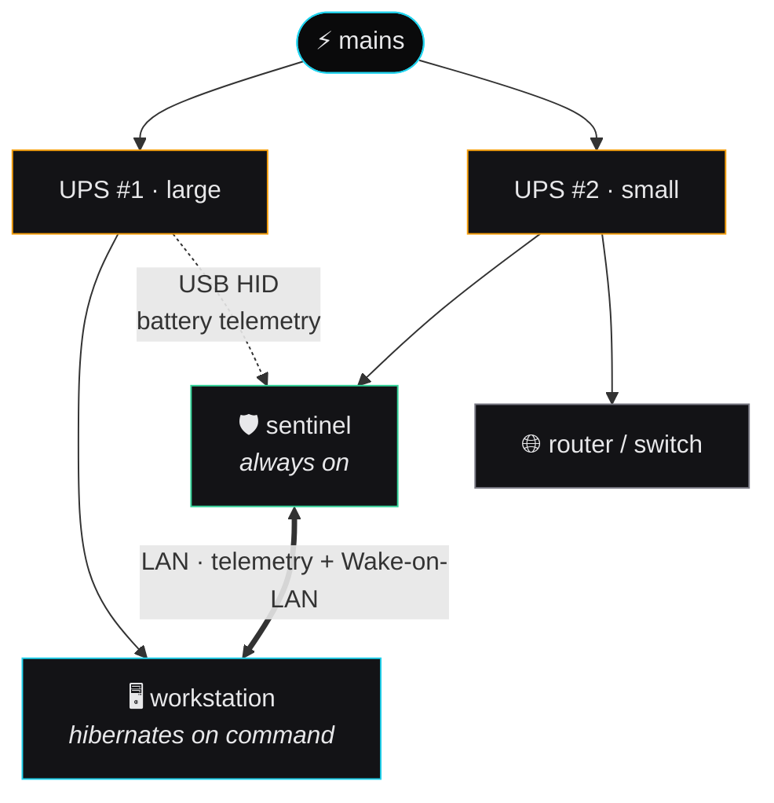
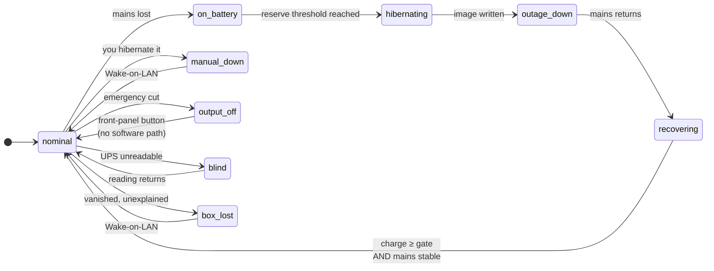

# Power Sentinel

Survive multi-hour power cuts without losing your workstation's session.

A small always-on Linux box (a Jetson Nano here, but anything works) holds the
UPS's USB cable and decides when to hibernate a much larger workstation, then
wakes it over the network once the power is genuinely back. It ships with a
dashboard, push notifications, and an emergency shutdown.



**The UPS's USB cable goes to the small box, not the big one.** That single
choice is what makes the rest work.

---

## Why it is built this way

The obvious design — run the UPS daemon **on** the machine you are protecting —
has a structural flaw:

> The process sequencing the shutdown gets frozen inside its own hibernate
> image. It cannot do anything after the machine goes down, because it *is* the
> machine going down.

So the UPS USB cable goes to a **separate always-on box on its own UPS**. That
box stays awake through the entire outage, watches the battery, and is still
running when the workstation is not. It is the only thing that can decide the
workstation should come back.

The second UPS is small and cheap — it only has to carry a SBC and a router.

## What it actually does

**Adaptive hibernate.** Not "shut down 60 seconds after the power fails". It
continuously computes how long the battery will last versus how long *this*
machine needs to write *its current* hibernate image, and acts when those meet:

```
runtime_to_reserve = battery_runtime × (charge − reserve) / charge
hibernate_cost     = ram_in_use_GiB / write_rate + fixed_overhead
                     hibernate when runtime_to_reserve ≤ hibernate_cost + safety
```

A loaded machine hibernates **earlier** than an idle one, because a bigger
image needs more battery to finish writing. Hibernating with charge left in
reserve is deliberate — a flat VRLA pack is a damaged VRLA pack.

**Gated recovery.** When mains returns, it does *not* immediately wake the
workstation. It waits until the pack has recharged past a threshold **and**
mains has held steady for a sustained period. Flapping power that comes back
for thirty seconds and dies again should not drag a workstation through a
hibernate/wake cycle each time.

**A dashboard** (installable PWA, works offline, mobile-first) showing one
"survival timeline" that answers the only question that matters: *will the box
survive this, and when does it come back?*

**Push notifications** via [ntfy](https://github.com/binwiederhier/ntfy), with
a disk-backed queue — because during an outage your internet is usually dead
too, and "MAINS LOST" is precisely the message most likely to be generated at
the one moment it cannot be sent. It is queued and replayed with its original
timestamp stamped into the body, so a late alert cannot be mistaken for a live
one.

**Emergency shutdown.** Two buttons, three taps, no typing: *safe* (hibernate,
wait for the draw to actually fall, then cut the UPS output) and *instant*
(cut now, whatever is running).

### Every state it can be in

The dashboard, the notifications and the logs all derive from one state
model, so they can never describe the same moment differently.



⚠ `output_off` has no software route back, and `blind` asserts nothing rather
than guessing. Both are deliberate: *"cannot read the sensor"* is a third
state, not a quiet synonym for *"everything is fine"*.

---

## Things this project learned the hard way

These cost real time to discover. They are why the design looks like it does.

### The UPS will not turn its own output back on

The plan was: hibernate the box, then cut the UPS output to save battery, and
let it restore power when mains returns. **This UPS cannot do that.**
`upscmd -l` offers `load.off` and `load.off.delay` but no `load.on` and no
`shutdown.return`. Tested for real:

```
load.off.delay fired → output cut → mains restored → ups.status = OL OFF
                                                                     ^^^
```

It comes back to life, charges, and talks over USB — with its output still
**off**, waiting for a human to press the front panel button. Worse, with no
output there is no +5VSB, so Wake-on-LAN cannot rescue the machine either.
Killpower was abandoned; Wake-on-LAN became the primary recovery path.

**Check your own UPS with `upscmd -l <ups>` before designing around killpower.**

### "Cannot read the sensor" is a third state

`on_battery` is `True`, `False`, or `None`. A bug shipped where `None` fell
into the `False` branch, so a dead sensor read as *mains is fine*. The logs
cheerfully announced "mains returned" during an outage.

Anything reading a sensor here treats absence as its own state and holds
position rather than guessing.

### A safety check validated against a cache is not a safety check

The wake threshold must stay above the hibernate reserve, or the machine wakes
into a charge where the governor immediately wants to hibernate again — a
wake/hibernate loop. That check initially ran against values learned from the
units' logs, which lag by a poll. A dangerous pair got through. It now
validates against the config files, which are what the units actually load.

### systemd gives up

Every unit here would have stopped trying permanently after 5 restarts in 10
seconds, and the distro's NUT units shipped `Restart=no` — so a UPS driver
crash (which happened) would never have recovered. A service whose job is to
still be running when everything else has failed must never stop trying.

### Wake-on-LAN evaporates when standby power does

WoL arming is a runtime setting stored in the NIC. Cut all power — including
+5VSB — and it resets. After an emergency output cut, WoL stays dead even once
power returns, until the machine boots once by hand. This does not affect
ordinary outages, where the UPS keeps the PSU alive throughout.

---

## Hardware

| | |
|---|---|
| **Sentinel** | Any always-on Linux box with USB + Ethernet. Developed on a Jetson Nano (arm64, 2 GB+). A Pi works. |
| **Second UPS** | Small; carries only the sentinel and your router/switch. |
| **Main UPS** | Must expose a USB HID interface NUT can drive. Developed against an APC Back-UPS. |
| **Workstation** | Must support hibernate (S4) and Wake-on-LAN from a wired NIC. |

**The workstation's wired NIC matters.** WoL is a layer-2 magic packet, so the
sentinel must be on the same subnet. This is not PXE and has nothing to do with
network boot.

## Install

```bash
git clone https://github.com/ajv009/nano-nano-power-sentinel
cd nano-power-sentinel
cp .env.example .env     # fill in your addresses, MAC, and UPS name
```

Then see **[docs/INSTALL.md](docs/INSTALL.md)**. In outline:

1. **Workstation** — a swapfile large enough for RAM, `resume=`/`resume_offset=`
   on the kernel command line, a unit that re-arms WoL at every boot.
2. **Sentinel** — NUT in server mode with the UPS on USB; the sentinel and the
   dashboard as systemd units.
3. **Both** — point `.env` at each other and deploy.

⚠ Everything site-specific lives in `.env` and `/etc/ups-dash/site.env`. The
compiled-in defaults are documentation-range addresses so a half-configured
install fails visibly instead of quietly sending magic packets at a stranger's
machine.

## Configuration

Thresholds are editable live from the dashboard's Config tab and take effect
without a restart. The important ones:

| Setting | Meaning |
|---|---|
| `reserve_pct` | charge that must remain **after** the hibernate write completes |
| `wake_charge_pct` | pack must refill to here before the machine is woken |
| `mains_stable_sec` | mains must hold this long, uninterrupted, before waking |

⚠ A bad config file can never stop the safety-critical processes starting. Any
value that is missing, malformed or out of range falls back to the compiled-in
default and logs loudly — per key, so one bad value never discards a good one.

## Safety

- **No login screen.** The dashboard assumes it is on a private network
  (Tailscale, or LAN-only). Do not expose it publicly as-is.
- **The emergency shutdown is not reversible from software** on a UPS like the
  one above. Read the warning in `upscmd.py` before enabling it.
- **This can power-cycle a workstation.** The controls are interlocked against
  the automation and require explicit confirmation, but they are real.

## Documentation

| | |
|---|---|
| [docs/DESIGN.md](docs/DESIGN.md) | architecture and the reasoning behind it |
| [docs/DASHBOARD.md](docs/DASHBOARD.md) | dashboard spec, state model, event catalog |
| [docs/BUILD-LOG.md](docs/BUILD-LOG.md) | the full build log — every change, every bug, with undo steps |

The build log is the unusual one. It is kept as a running record including the
mistakes, because the mistakes are most of the value.

## Credits

This project is mostly glue around other people's good work, plus a lot of
reading. Everything below was genuinely used or consulted.

### Runtime dependencies

| | |
|---|---|
| **[Network UPS Tools](https://networkupstools.org/)** ([repo](https://github.com/networkupstools/nut)) | the entire UPS layer — `usbhid-ups`, `upsd`, `upsmon`, `upscmd`. The wire protocol is simple enough to speak directly, which is what the collector does. |
| **[ntfy](https://github.com/binwiederhier/ntfy)** by Philipp Heckel | push notifications, self-hosted. A single Go binary that costs ~45 MB of RAM and needed no tuning. |
| **[uPlot](https://github.com/leeoniya/uPlot)** by Leon Sorokin | the episode charts. ~45 KB, no dependencies, and fast enough for a 2-core ARM board — vendored rather than pulled from a CDN so the dashboard works offline. |
| **[Tailscale](https://tailscale.com/)** | HTTPS and a hostname for the dashboard without exposing it. `tailscale serve` is what makes the PWA installable at all. |
| **[cloudflared](https://github.com/cloudflare/cloudflared)** | publishes only the ntfy endpoint, since a phone is not always on the tailnet. |
| **[BusyBox](https://busybox.net/)** `devmem` | naturally-aligned MMIO access for the Ethernet LED registers. Python's `mmap` raises SIGBUS there on ARM. |

### Sources that solved specific problems

- **[coreboot](https://github.com/coreboot/coreboot)** — `src/drivers/net/r8168.c`
  documents the RTL8111/8168 LED configuration register at offset `0x18` and
  the `0x50` config lock. Nearly every other guide describes the RTL8211F PHY
  and MDIO page `0xd04`, which is *different hardware* and does not apply to
  the Jetson Nano dev kit's PCIe Realtek.
- **[Chrome for Developers](https://developer.chrome.com/blog/update-install-criteria)**
  and **[web.dev](https://web.dev/learn/pwa/update)** — current PWA
  installability criteria and service-worker update strategy. The
  [Workbox notes on update handling](https://developer.chrome.com/docs/workbox/handling-service-worker-updates)
  are why this uses network-first plus a build stamp rather than a hand-bumped
  cache version.
- **[MDN — Making PWAs installable](https://developer.mozilla.org/en-US/docs/Web/Progressive_web_apps/Guides/Making_PWAs_installable)**
- **[NVIDIA Jetson developer forums](https://forums.developer.nvidia.com/c/agx-autonomous-machines/jetson-embedded-systems/70)**
  — confirmation that the Nano's green power LED is driven by GPIO04 and is
  not exposed without a device-tree change.
- **[Arch Wiki](https://wiki.archlinux.org/)** — hibernation into a swapfile,
  `resume=` / `resume_offset=`, and the dracut/`kernel-install` path. Its
  warning that generated loader entries must not be hand-edited saved a
  silent breakage months down the line.
- **[systemd documentation](https://www.freedesktop.org/software/systemd/man/systemd.service.html)**
  — `StartLimitIntervalSec`, drop-in overrides, and `Type=oneshot` semantics,
  which is why a succeeded oneshot is no longer reported as a failure here.
- **[polkit](https://www.freedesktop.org/software/polkit/docs/latest/)** — the
  narrow authorisation rule for `org.freedesktop.login1.hibernate`. Needed
  because `NoNewPrivileges=yes` makes sudo inert, which is not obvious until
  it silently does nothing.

### Hardware documentation

- APC Back-UPS HID tables via NUT's `usbhid-ups` driver — the definitive
  answer to what a given UPS can and cannot do. **Run `upscmd -l` on yours
  before designing around killpower.**
- Realtek RTL8111H register layout, for the LED control bitfield.

### Built with

Developed with [Claude Code](https://claude.com/claude-code). The build log in
[docs/BUILD-LOG.md](docs/BUILD-LOG.md) is the unedited record, including the
wrong turns.

## Licence

MIT — see [LICENSE](LICENSE).

Third-party components keep their own licences: NUT is GPLv2+, ntfy is
Apache-2.0/GPLv2, uPlot is MIT, cloudflared is Apache-2.0. No third-party
source is vendored here except `uPlot` (MIT), under `src/ups-dash/web/vendor/`.
